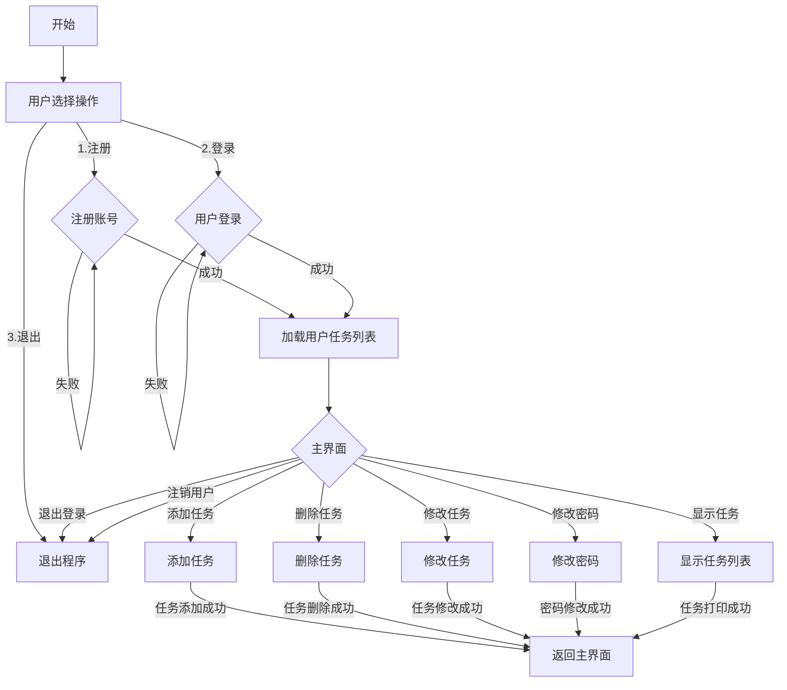

# 设计文档

## 1. 概述

在本门课程中，我们将使用C++语言在Linux系统中开发一个有用而且有趣的日程管理软件。本文档旨在阐明我们小组任务管理器的系统设计，包括模块与类的设计、流程图、以及关键技术问题的说明。

## 2. 小组成员名单及分工

马悦钊：
Linux版本head.h、Account、task、thread1、thread2的编写及debug，run、main的合作编写，多线程运行的实现，Cmakelist和test.sh的编写，设计文档的合作编写。

刘亦唐：
cli的编写，run、main的合作编写，项目整体的debug，多线程运行的实现，设计文档的合作编写。

>陈炳安：
Windows版本的改编和debug；
王泽聪：
Windows版本的改编和图形化界面的实现。

## 3. 模块与类的设计

### 3.1 模块概述

任务管理器主要分为以下几个模块：

- **用户账户管理模块**：负责用户的注册、登录、密码修改和账户删除。`Account`
- **任务管理模块**：提供任务的增删改查功能。`task`
- **命令行接口模块**：解析用户输入的命令，并调用相应的功能。`main` `cli`
- **多线程模块**：以run命令运行两个线程，线程一以shell方式循环运行，接受用户命令；线程二定期检查任务的提醒时间，并通知用户`run` `thread1` `thread2`

### 3.2 类设计

#### 3.2.1 `Account` 类

- 保存用户信息的储存地址。
- 负责用户账户的逻辑处理。
- `Account.h` 提供注册、登录、修改密码和删除账户的函数。

#### 3.2.2 `Task` 结构体

- 表示一个任务的所有属性，包括ID、名称、优先级、类别、开始时间、提醒时间和详细信息。
- `task.h` 提供任务属性和`string` 之间的转换的函数。
- `task.h` 提供各种方式打印任务的函数。
- `task.h` 还提供加载和保存任务的函数，实现内存与本地账户文件之间的交互。

#### 3.2.3 `User` 结构体

- 表示用户的基本信息，包括用户ID、用户名和密码。

#### 3.2.4 `ThreadInfo` 结构体

- 用于线程间共享的用户信息和同步机制。

## 4. 以run方式运行的流程图



## 5. 关键技术问题说明

### 5.1 多线程同步

任务管理器使用多线程来提高性能，线程1处理用户交互，线程2负责检查任务提醒。使用互斥锁（mutex）来同步对任务列表的访问，确保数据的一致性。
每个线程可以访问共享资源，并通过互斥锁来保证数据的正确性。通过多线程并行执行，可以加快程序运行速度，提高系统的效率。

```cpp {.line-numbers}
//create thread
pthread_mutex_t mutex = PTHREAD_MUTEX_INITIALIZER;
pthread_t *th_1, *th_2;
thread_arg.mutex = &mutex;
thread_arg.user = &current_user;
thread_arg.running = true;

//create thread1
th_1 = new pthread_t;
if(pthread_create(th_1, NULL, thread1, &thread_arg)){
    cout<< "Create thread 1 failed.\n";
    exit(-1);
}

//create thread2
th_2 = new pthread_t;
if(pthread_create(th_2, NULL, thread2, &thread_arg)){
    cout<< "Create thread 2 failed.\n";
    exit(-1);
}

//main thread
pthread_join(*th_1, NULL);
pthread_join(*th_2, NULL);
```

### 5.2 文件锁

为了在多用户环境中安全地读写任务文件，使用文件锁来防止多个进程同时写入同一个文件。

```cpp {.line-numbers}
//read tasklist
pthread_mutex_lock(mutex);
vector<Task> tasklist = loadTaskFromFile(user);
pthread_mutex_unlock(mutex);

//...

//save tasklist
pthread_mutex_lock(mutex);
saveTask2File(tasklist, user);
pthread_mutex_unlock(mutex);
```

### 5.3 命令行参数解析

为了从命令行接受并解析用户输入的参数，执行对应指令，使用 `getopt` 函数来解析命令行参数。

```cpp {.line-numbers}
char optret;
while((optret = getopt(argc,argv,"u:p:"))!=-1){
    switch(optret){
    case 'u':
        username = optarg;
        break;
    case 'p':
        password = optarg;
        break;
    default:
        break;
    }
}
```

### 5.4 日期和时间处理

日期和时间的处理需要考虑时区、闰年等复杂情况。使用 `<ctime>` 和 `<iomanip>` 库来格式化和转换日期时间。

```cpp {.line-numbers}
//检查日期格式
bool checkDateFormat(const string& str) {
    // define regular expression
    regex re(R"(^\d{4}-\d{2}-\d{2}/\d{2}:\d{2}:\d{2}$)");
    // judge
    if(!regex_match(str, re))return false;
    
    tm time = {};
    istringstream iss(str);
    iss >> get_time(&time, "%Y-%m-%d/%H:%M:%S");
    time_t tm=mktime(&time);
    if( tm==-1 || convertTimeToString(tm)!=str ) return false;
    return true;
}
```

### 5.5 用户输入验证

对于用户输入的数据，如任务名称、时间、序号等，需要进行严格的验证，以确保它们符合预期的格式和逻辑,以及保证用户名、任务名称和开始时间的唯一性。

```cpp {.line-numbers}
//检查日期格式
bool checkDateFormat(const string& str);
//检查id格式
bool checkIdFormat(const string id);
//其他验证在对应函数中直接实现，未包装成函数，如：
string stime;
valid = false; 
while (!valid){   
    cout << "Please input the task start time " << QUIT << ": ";
    getline(cin, stime);
    if (stime == "ESC") return;
    if (stime == ""){
        newtask.start_time = time(NULL);
        valid = true;
        break;
    }
    //check if date format is valid
    if (!checkDateFormat(stime)){
        cout << "Invalid date format!" << endl;
        continue;
    }
    //check if date is in the past
    if (convertStringToTime(stime) < time(NULL)){
        cout << "Start time cannot be earlier than current time!" << endl;
        continue;
    }
    //check if date is exist
    bool exist = false;
    for (int i = 0; i < tasklist.size(); i++){
        if (tasklist[i].start_time == convertStringToTime(stime)){
            cout << "Task start time already exists!" << endl;
            exist = true;
            break;
        }
    }
    if (!exist){
        newtask.start_time = convertStringToTime(stime);
        valid = true;
    } 
}
```

## 6. 学习心得及建议反馈

### 6.1 学习心得

本次课程项目要求我们基于linux平台使用C++开发一款日程管理软件。
在这次项目中，我们对命令行处理、文件读写、多线程编程、文件锁以及合作开发软件的流程有了一定的掌握并且进行了练习，这不仅增加了我们对于linux平台编程的知识和了解，也锻炼了我们的编程能力，更在实践中培养了我们的版本管理意识与技巧。

在项目中，我们深化了C++编程语言的学习，掌握了Linux Bash基本命令，深入了解了编译、链接以及调试等关键概念和工具的使用。通过课上的项目，得到了宝贵的编程实践经验。课程中MakeFile、CMake和Git等工具也让我更好地理解了代码组织、版本控制和团队协作的重要性。

### 6.2 建议反馈

本次项目发布较早，因此我们小组第一时间就开始了学习相关知识并开始推进项目。
但由于老师在小学期第三周临时更改作业要求，组员上限由原来的4人一组变更为2人一组，任务要求也提高了难度，导致我们不得不更换开发目标，经老师同意改为四人合作完成Linux和Windows双版本，并完成Windows版本的图形化。
希望之后老师在发布作业时能不要中途更改。
